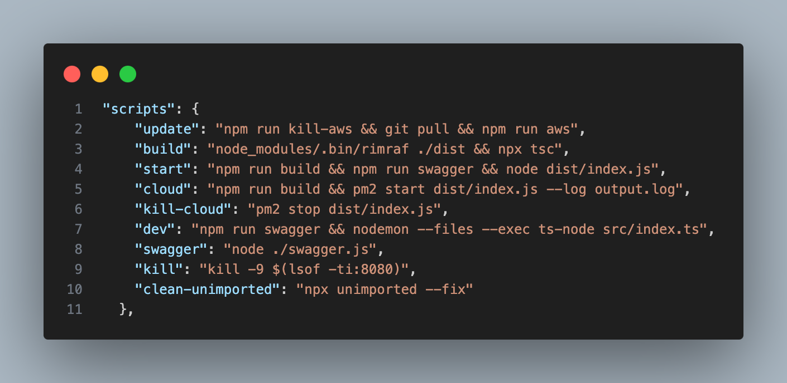
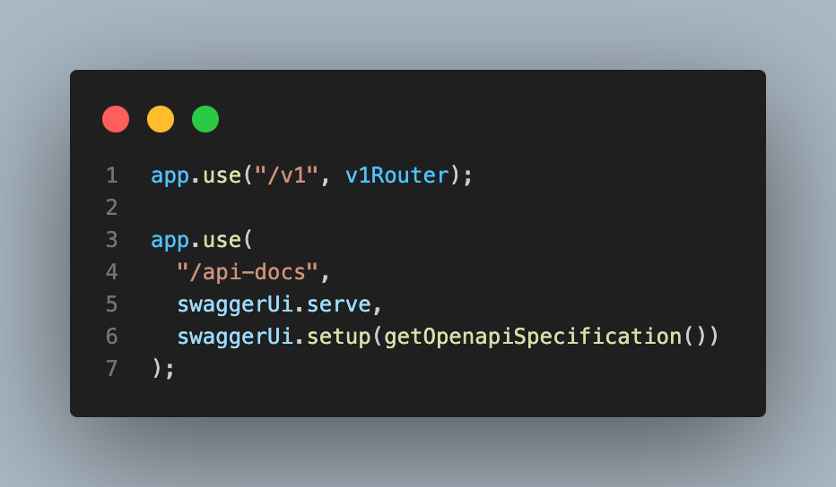
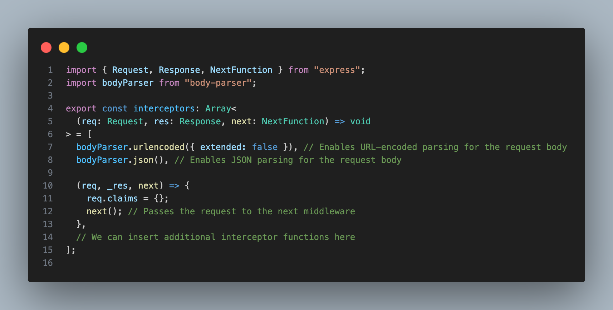
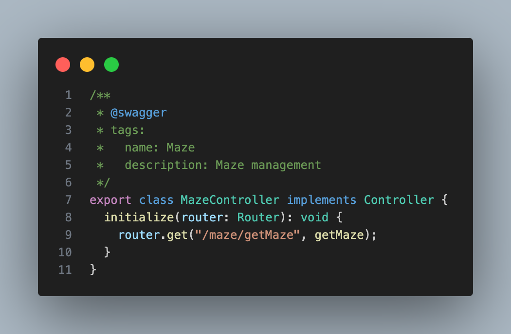
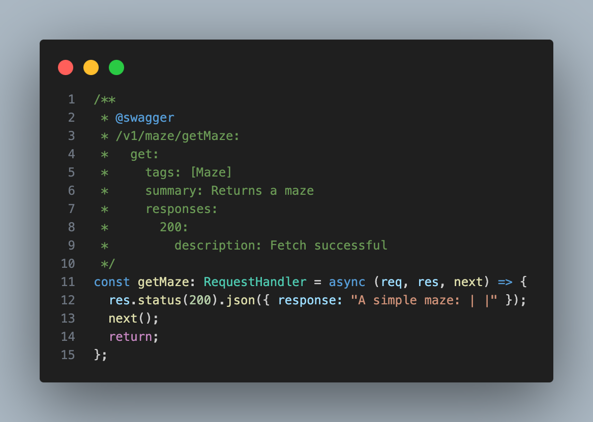
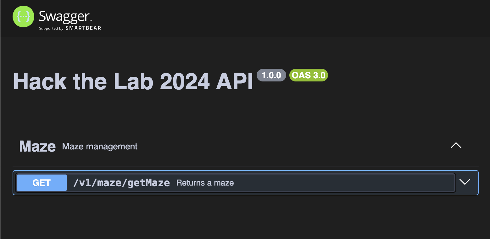

# Hack the Lab 2024 API

This is the API for Hack the Lab 2024. It's written with Typescript for Node.js and Express.js.

## Getting started

- Install Node v21.6.2 via the Node Version Manager tool:
  - Install nvm: `brew install nvm`
    - Pay close attention to the install output, there is an important step at the end to complete installation.
        ```
        postgres_server  | psql:/docker-entrypoint-initdb.d/1-schema.sql:89: NOTICE:  New ... key created with id # and api_key: "..."
        ```
        

  - Install Node v21.6.2: `nvm install 21.6.2`
  - Set Node v21.6.2 as the default version: `nvm alias default 21.6.2`
  - Verify that Node v21.6.2 is installed: `node -v`
- (Optional: for local development) Install [Docker](https://docs.docker.com/get-docker/)
  - Using homebrew: `brew install --cask docker`
  - Verify that docker is installed: `docker run hello-world`
  - The alternative is to configure the backend to use remote postgres & redis servers. More on that below
- Clone the repository: `git clone https://github.com/MichiganLabs/Hack-the-Lab-Backend.git`
- Navigate to the project directory: `cd Hack-the-Lab-Backend`
- Edit your environment file (`.env`) in the root directory of the project directory. (Reference below, you can also copy the `.env.example`)
- Install the dependencies: `npm i`
- If you have docker installed, start the containers: `docker compose up --detach` (or `-d`) (You do not need to do this between server restarts.)
- Run the server locally: `npm run dev`

## How things are organized

`package.json`: This contains all of the dependencies and helpful scripts for the project. You can run any of these scripts with `npm run <script-name>`, or create your own. They will always run as though you're running them from the root of the project, via terminal. We can use these commands to help speed up tasks, and automate deployments.



`index.ts`: This is the entry point for the server. It sets up the Express app, and starts the server. It applies our middleware, routes, and interceptors. Below is a snippet from the `index.ts` file, showing how simple versioning is implemented, as well as a top level route for Swagger docs. This top level route bypasses our versioning and middleware, so that anyone can access it.



The `middleware` folder contains just our interceptors for now. These are used to handle requests and responses, and to apply logic to them and "intercept" the request for further processing. Below is the `middleware/interceptors/index.ts` file, showing how some basic necessities are setup:



The `controllers` folder contains our route handlers. These are the functions that are called when a route is hit. They are responsible for processing the request, and returning a response. Below is part of the `maze-controller.ts`. 

In this backend project, we follow this pattern: `/v1/route/command`. Every route is a higher level grouping of commands. `maze-controller` is the `route` portion of this pattern, and sets up what commands are available for the `maze` route.

Notice also how Swagger annotation is applied above the function declaration. This is picked up automatically by our Swagger doc generator, and used to create the documentation for the API.



`getMaze` is one of our basic commands under the `maze-controller`. It's a `GET` request, and it's used to retrieve a maze. Below is the function signature, and the Swagger annotation for it:



The generated swagger will aggregate all the annotations and render the dynamic spec json at `/api-docs`




# .env File
This file is used to define secrets used by the app. Rather than defining these system wide, the .env file allows them to be used and changed per directory.

If you are using the docker infrastructure, the docker-compose.yaml will also use this file to configure the postgres container.

Here is an example .dotenv file.
```conf
POSTGRES_HOST=localhost
POSTGRES_DB=hackthelab
POSTGRES_USER=root
POSTGRES_PASSWORD=tomato
POSTGRES_PORT=5432
REDIS_HOST=localhost
REDIS_PORT=6379
REDIS_USER=
REDIS_PASS=
```